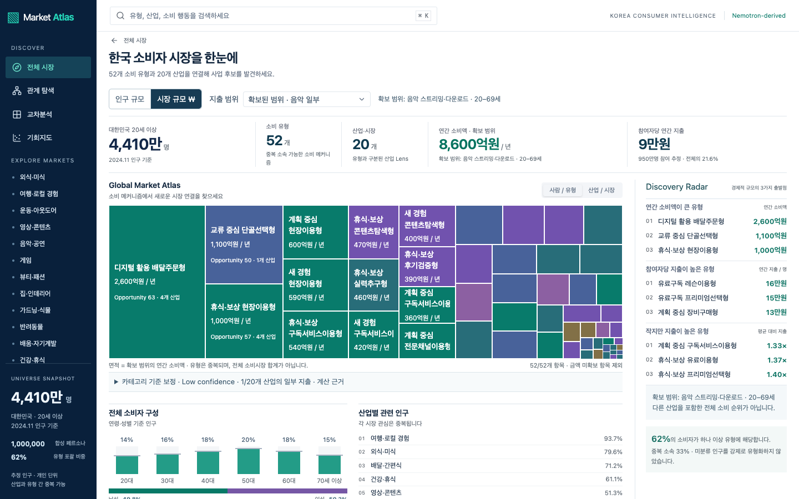
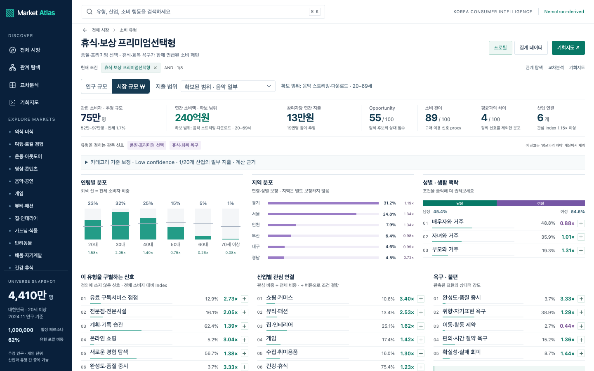
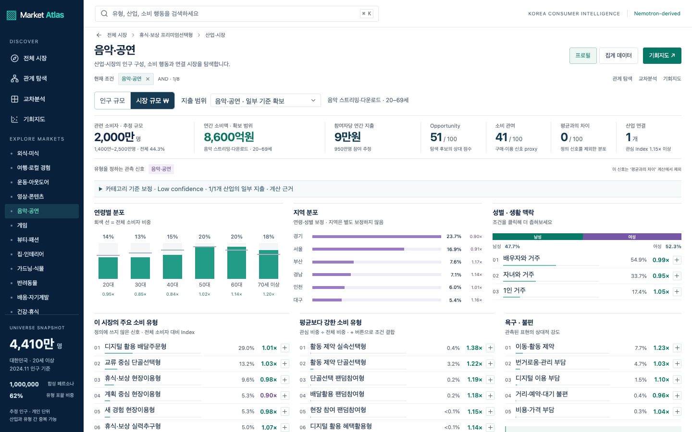
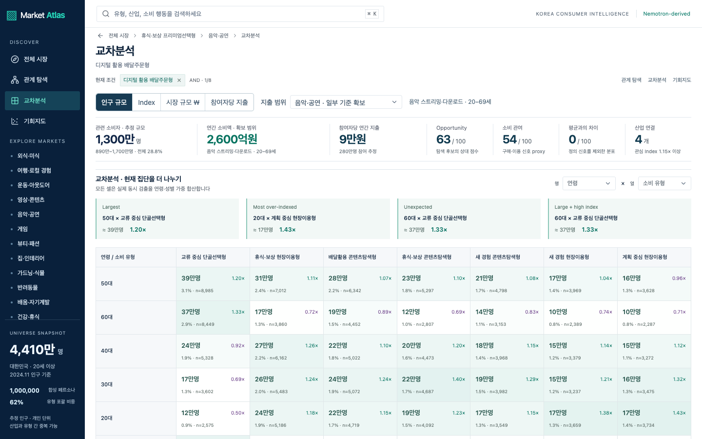
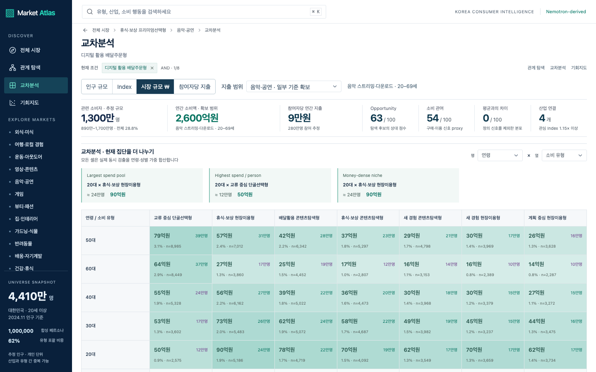
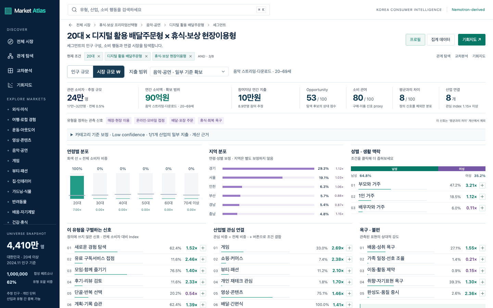
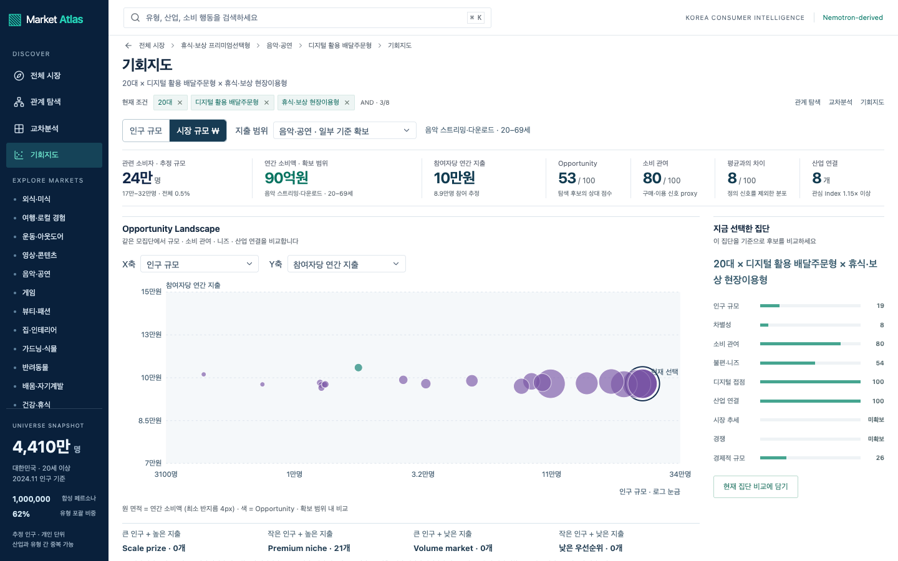
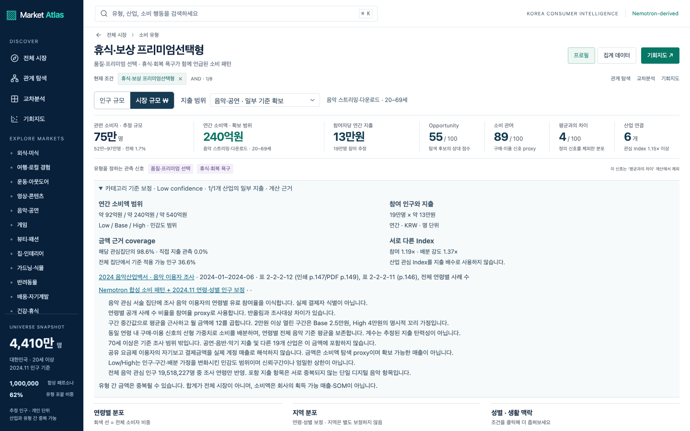
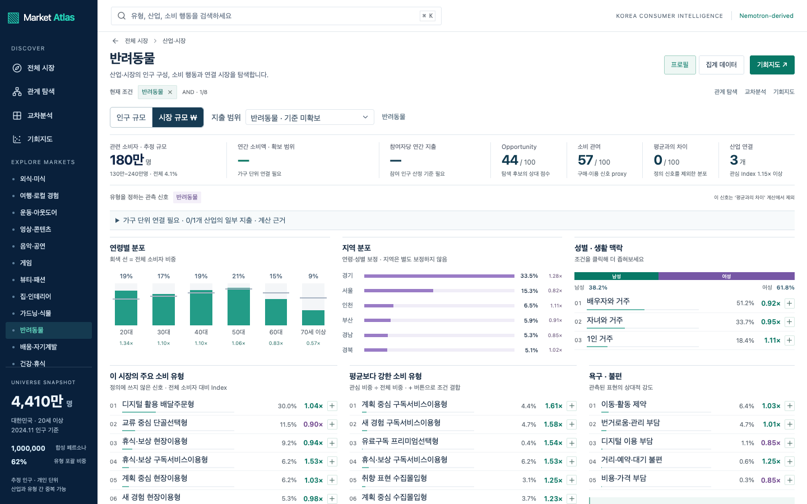
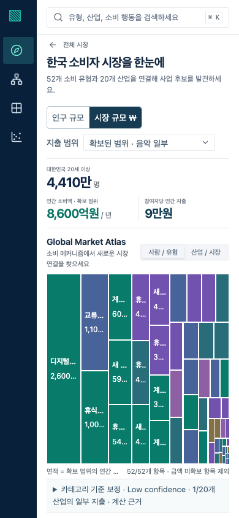

# Market Value Browser QA

> 이 문서는 v0.4 브라우저 검증 기록입니다. 현재 산식·외부 인구 보정·14/20개 산업 범위는 [개정 문서](EXTERNAL_SPEND_AND_POPULATION.md), 현재 전수 검증은 [research-demand-sanity.json](../data/research-demand-sanity.json)을 사용합니다.

실제 Chromium/agent-browser, 1440×900 및 390×844에서 탐색했다. 개발 서버에서 전체 여정 25단계를, 완성된 Cloudflare Worker에서 Matrix 모드·브라우저 history·근거·모바일을 추가 검증했다. 브라우저 uncaught errors는 0개다.

## 전체 여정

|단계|확인|도착 화면|
|---|---|---|
|1|Population Atlas|한국 소비자 시장을 한눈에|
|2|Money Atlas|한국 소비자 시장을 한눈에|
|3|Premium-related actual archetype|휴식·보상 프리미엄선택형|
|4|Top supported industry by spend|음악·공연|
|5|Market to archetype by spend|디지털 활용 배달주문형|
|6|Context to Matrix|교차분석|
|7|Matrix money changes cell values|교차분석|
|8|Money cell to Segment|20대 × 디지털 활용 배달주문형 × 휴식·보상 현장이용형|
|9|Segment to Money Opportunity|기회지도|
|10|Economic axis switching|기회지도|
|11|Money axes and comparison survive reload|기회지도|
|12|Relationship keeps monetary context|관계 탐색|
|13|Search includes population and monetary scope|관계 탐색|
|14|Industry money map states partial coverage|한국 소비자 시장을 한눈에|
|15|Industry audit pet|반려동물|
|16|Industry audit travel|여행·로컬 경험|
|17|Industry audit education|배움·자기계발|
|18|Industry audit beauty|뷰티·패션|
|19|Industry audit wellness|건강·휴식|
|20|Industry audit food|외식·미식|
|21|Industry audit content|영상·콘텐츠|
|22|Industry audit finance|개인 재테크 관심|
|23|Industry audit home|집·인테리어|
|24|Industry audit music|음악·공연|
|25|Mobile money Atlas|한국 소비자 시장을 한눈에|

실제 유형 `arc_premium_recovery`(휴식·보상 프리미엄선택형)를 사용했다. 요구사항의 예시 이름이나 숫자를 별도 데이터로 만들지 않았다. 금액 기준이 있는 음악·콘텐츠·게임으로 이동했고, 다른 6개 산업의 결손/가구 단위 상태도 화면에서 확인했다.

## 배포 빌드 추가 검증

- Matrix 인구·시장금액·참여자당 지출·Index 버튼으로 셀 값과 URL 전환을 확인했다.
- Back으로 Spend/Unit, Forward로 Index가 복구되고 `spend=music`이 유지된다.
- 계산 근거를 펼쳐 Low/Base/High, 참여율, 인구/단위 지출, coverage, 출처와 가정을 확인했다.
- 모바일의 기존 CSS가 금액 지표를 숨기던 문제를 수정했다. 390px에서 금액 지표가 표시되고 본문 가로 넘침이 없다.
- 검색 결과의 인구·금액, 비교 2개 선택, 새로고침, Relationship의 지출 범위 유지, Opportunity 축 전환이 작동한다.
- Built Worker에서 8개 API + 8개 HTML route, 검색, 잘못된 범위 400, 빈 교집합 0/null, 70세 이상 미확보를 별도로 검증했다.

## 화면 증거

### Global Atlas · Money

### Archetype

### Market

### Matrix · Population

### Matrix · Money

### Segment

### Opportunity

### Low/Base/High와 출처

### Household mapping 결손

### 모바일 금액 지표

[기계 검증 로그](../data/market-value-browser-qa.json) · [Worker 측정](../data/market-value-performance.json)

이 검증은 음악 부분 지출 Lens가 작동한다는 증거다. 나머지 산업의 금액을 추정할 근거를 확보했다는 의미가 아니다.
