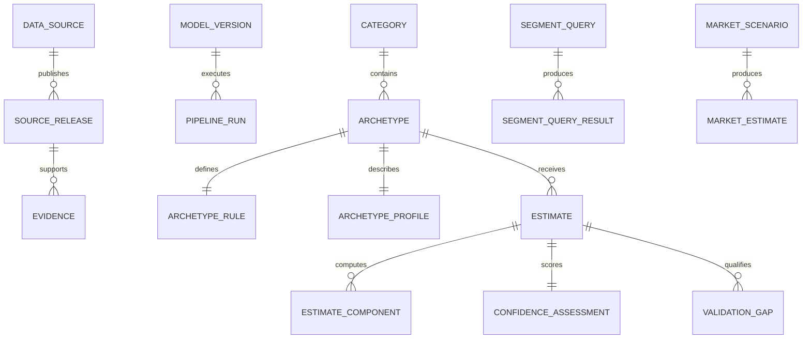

# Data model and storage

PostgreSQL 15+ is the normalized system-of-record design for metadata, rules, lineage, estimates, assumptions, confidence, gaps, query history, and market scenarios. `migrations/001_core.sql` creates the unchanged 30-table Phase 1 schema. Additive `migrations/002_phase2_domains_subtypes.sql` adds 28 domain, model, subtype, allocation, semantic parent-case, activation, feedback, and acceptance tables for a total of 58, with PK/FK/UNIQUE/CHECK constraints plus BTREE and GIN indexes. The workbench migration source now extends through `018` to 90 public base tables and 17 views. Migration `014` adds interval/source-lineage checks, `015` adds nonnegative/ratio-domain checks, `016` replaces the catalog policy projection and adds finite-number checks, `017` adds Opportunity primary-target and pinned-snapshot invariants without changing the table/view counts, and `018` adds five canonical release-safe projections while replacing seven downstream view definitions. A disposable clean/full-reapply database and a populated verification clone both reached `018`/90/17; the original populated `market_engine` database was deliberately left untouched at `016`/90/12. See `docs/18_workbench_data_dictionary.md`. DuckDB and Zstandard Parquet provide the local analytical implementation and exports.

Frequently filtered dimensions are typed columns; only sparse attributes and rule payloads use JSONB. All mutable tables include `created_at`, `updated_at`, `data_version`, and `created_by_run_id`. Raw inputs are immutable/ignored by Git, while manifests and checksums are tracked. Long Nemotron narratives remain only in raw Parquet; the feature mart stores structured fields and provenance.

Migration `018` is a trusted-application read boundary rather than hard database confidentiality: existing runtime roles still have broad raw-table `SELECT`. Its projections suppress two legacy human Base-below-10 estimates in the populated clone without changing the ledger. Current subtype allocations contain no such human rows, but future raw subtype detail remains a disclosed release residual until a release-safe subtype projection exists. Domain axes and subtypes remain separate modeled layers because no direct evidence-backed axis→subtype relationship is stored.
