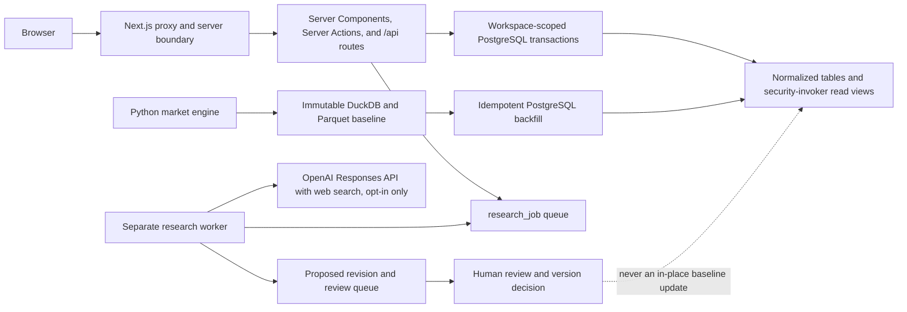

# Market Intelligence Workbench architecture

This document is the Phase 3–7 handoff for the PostgreSQL-backed web workbench in `web/`. The workbench is an additive interface over the Phase 1–2 market engine. It does not replace the deterministic Python build, the immutable DuckDB/Parquet artifacts, or the provenance rules in `docs/00_mission_and_scope.md` through `docs/15_phase2_dod_audit.md`.

| Plan slice | Handoff coverage |
|---|---|
| P3-0/P3-1 diagnosis and PostgreSQL foundation | This architecture/ADR, `docs/18_workbench_data_dictionary.md`, and the baseline manifests |
| P3-2/P4 shell, explorer, and governance | Repository/read-model boundary and `docs/17_workbench_api.md` |
| P5 segment builder and sizing | Unit/interval/provenance contracts in the API and data dictionary |
| P6 research and review | Worker/auth boundary and `docs/19_research_workflow.md` |
| P7 comparison, opportunities, and exports | API/data contracts and `docs/20_workbench_operations.md` |

## Architecture at a glance



The runtime has four deliberate boundaries:

1. The Python package under `src/market_engine/` builds, validates, and exports the evidence-backed baseline. Large immutable inputs and feature marts remain in Parquet/DuckDB under `data/`.
2. The separate Next.js application under `web/` renders the workbench and owns browser-facing routes, form actions, authentication, and PostgreSQL repository calls.
3. PostgreSQL is the shared contract for canonical baseline records, workbench state, append-only history, workspace isolation, and read models. Migration source extends through `018`. Migration `017` guards Opportunity primary-target uniqueness, pinned query/result/saved-version/market-scenario lineage, append-only primary links, and runtime privileges. Migration `018` adds five release-safe projections and replaces seven downstream view definitions without changing a base row. The source-tree target and disposable initial/full-reapply harness are 90 public base tables/17 views; a populated clone reaches that target with its raw fingerprint preserved. The original populated local database remains deliberately at `016`/90 tables/12 views and is not a post-`018` runtime certificate.
4. The research worker is a separate Node process. It claims queued jobs, makes an explicitly enabled external call, validates the structured response, and writes a proposal for review. It does not publish or mutate baseline records.

## Data planes

| Plane | Authoritative storage | Writers | Guarantees |
|---|---|---|---|
| Source and feature plane | `data/raw/`, `data/processed/**/*.parquet`, DuckDB | Python pipelines | Immutable/versioned inputs, fixed seeds, source checksums |
| Canonical relational plane | Phase 1–2 PostgreSQL tables | Migration/backfill and governed release processes | Explicit unit, denominator, period, method, source lineage, confidence, gaps |
| Workbench plane | Phase 3 tables in `003_workbench.sql` | Next server and worker through scoped transactions | Workspace isolation, version rows, audit events, review gates |
| Read-model plane | Twelve original `v_*` views plus five migration-`018` release projections | No direct writer | Real database joins only; no demo counts, no manufactured missing distribution, and value-free trusted-application reads for rare human estimates |

The deterministic backfill copies only the relational baseline needed by the workbench. The million-row Nemotron feature mart and synthetic link marts remain immutable analytical inputs; they are not duplicated into PostgreSQL. See `reports/phase3_postgres_backfill_manifest.md` for the verified import counts and reconciliation.

## Request and trust boundaries

### Browser to Next.js

Database URLs, PostgreSQL credentials, the access secret, and `OPENAI_API_KEY` are server-only. None may use a `NEXT_PUBLIC_` prefix. Browser forms invoke Server Actions in `web/src/actions/workbench.ts`; the limited JSON/download interface is documented in `docs/17_workbench_api.md`.

The four JSON mutation routes (`/api/segments`, `/api/estimate`, `/api/opportunities`, and `/api/research`) stream and count request bytes rather than buffering an unbounded body. They reject a declared or observed body above 128 KiB with `413`, and malformed JSON with `400`. Segment condition payloads also have independent AST ceilings: depth 12, 1,024 nodes, 256 items per array, 64 keys per object, 16,000 characters per string, and 64,000 total string characters. Main JSON data routes use a 512 KiB serialized response ceiling. Export JSON/CSV/HTML responses use a separate 5 MiB UTF-8 ceiling. Either overflow returns a small non-downloadable `500 response_body_too_large` JSON error with `Cache-Control: no-store`.

`web/src/proxy.ts` protects pages, Server Actions, and `/api` routes:

- `WORKBENCH_AUTH_MODE=local` is accepted only when `NODE_ENV` is not `production`.
- Production defaults to and requires `WORKBENCH_AUTH_MODE=secret` plus a secret of at least 32 characters.
- Browser login stores only the SHA-256 digest in a 12-hour, HTTP-only, SameSite=Strict cookie. Production cookies are Secure.
- API clients may send the configured secret as `Authorization: Bearer …`.
- Unauthenticated APIs return `401`; invalid production auth configuration returns `503`; protected pages redirect to `/access`.

The current production boundary is intentionally a single configured workspace and actor, supplied by `WORKBENCH_DEFAULT_WORKSPACE_ID` and `WORKBENCH_DEFAULT_ACTOR_ID`. `workspace_member.role` records `owner`, `editor`, `reviewer`, `viewer`, or `worker`, but the current shared-secret mode does **not** implement per-person login or per-role application authorization. Do not describe it as multi-user SSO or RBAC. A future identity provider must verify a member and install its trusted `{workspaceId, actorId}` in `AsyncLocalStorage`; values from form fields, headers, or URL parameters must never be trusted directly.

### Next.js to PostgreSQL

Mutations and workspace-aware reads use `withWorkspaceTransaction`. It starts a transaction and sets these transaction-local parameters before executing repository SQL:

```text
market_engine.workspace_id
market_engine.actor_id
```

Row-level-security policies compare workspace-owned records against `market_engine.workspace_id`. Read views are `security_invoker`, so they retain the caller's table privileges and RLS behavior. Production connections must use a non-owner, non-superuser, non-`BYPASSRLS` login associated with the appropriate `market_engine_app` or `market_engine_worker` privilege role. The migrations create those roles as `NOLOGIN`; credential provisioning is an operator responsibility.

Global catalog/evidence tables are readable to both runtime roles. Workspace-owned tables are isolated by RLS. Some canonical records intentionally have `workspace_id IS NULL` and are shared approved baseline records. Migrations `007`–`016` establish the baseline/read/write/lineage/numeric boundaries documented in the data dictionary. Migration `017` independently validates each Opportunity link's board/query-result workspace, optional saved-version query/result pin, optional market-scenario base result, and one-primary-target rule before installing insert and append-only guards. Legacy saved versions with a null result pin use the immutable same-query link result as authority; a non-null version pin must match exactly. Migration `018` then classifies existing `suppressed` rows and every human-unit estimate with Base below 10 in one canonical view, adds component/assumption/sensitivity/query-result projections, and rewrites estimate-bearing catalog, segment, comparison, Opportunity, and search views to consume the safe projections. Its preflight fails before view replacement on incompatible objects or unclassifiable invalid/non-finite human intervals.

Both runtime roles still retain broad raw-table `SELECT`. Consequently, migration `018` is a canonical trusted-application repository/export boundary, not hard confidentiality against arbitrary SQL with those credentials. Production must confine the roles to reviewed server code or narrow grants before making a stronger claim.

### Worker to provider

The browser only creates a job. `npm run worker` continuously claims queued jobs; `RESEARCH_JOB_ID=<reviewed-uuid> npm run worker:once` explicitly targets one queued or configuration-required job. An external call occurs only when both `OPENAI_RESEARCH_ENABLED=true` and `OPENAI_API_KEY` are present in the job-creating Next server and the executing worker. The provider response must satisfy `research-result-v2`; invalid responses become error artifacts and never enter the review queue as valid proposals. Provider echoes of the baseline and task identity are checked against the canonical job input; a mismatch is retained as validation metadata while the canonical input remains authoritative.

The OpenAI adapter uses `store: false`, keeps source URLs and locators in structured output, and requires explicit denominators, units, reference years, observation class, limitations, confidence components, and variables to verify. It builds the provider-source ledger only from completed web-search calls, collecting returned `search` sources and visited `open_page`/`find` URLs; incomplete calls contribute no URLs. A structured evidence URL is accepted only when its normalized final URL appears in that ledger, and obvious search-results URLs are rejected. This validates provider-tool provenance, not whether the cited passage semantically proves the claim. This code path has not been certified here with live credentials; see `docs/19_research_workflow.md` for the operational states and review contract.

## Baseline and publication boundary

The following rules are architectural constraints, not UI conventions:

- Phase 1–2 canonical baseline rows are not edited in place by workbench research.
- A missing joint distribution produces an `estimate` with status `not_estimable`, null counts, E-grade confidence, and a validation gap. It is never converted to zero and no independence assumption is inserted.
- `person`, `child_person`, `household`, `establishment`, and `enterprise` remain distinct. A conversion requires a recorded `entity_unit_bridge` with Low/Base/High factors, denominator, formula, evidence, model version, status, and confidence.
- Segment queries/condition ASTs/results, saved segment versions, opportunity scores/content, review decisions, research events/artifacts, and audit events preserve immutable or append-only history. Query-result updates are limited to cache status and invalidation time.
- Every enabled condition is revalidated against the database-backed condition catalog before persistence. Unknown/non-queryable entries, blocked sensitivity classes, and namespace/entity-unit/operator/type/allowed-value mismatches fail closed; direct POST cannot manufacture an unregistered `custom` condition.
- A bounded high-confidence personal-data scanner runs before segment free-text/payload, market-scenario, comparison, Opportunity, review-note/modification, and research persistence and before/after provider exchange. The fully enriched canonical research payload is scanned again after its saved-segment context is loaded and immediately before persistence. It rejects recognized email, phone, resident-registration, labeled account/financial-account, and detailed street-address patterns without echoing the rejected value. Regular-expression coverage is not universal PII or real-name detection, so policy and operator review remain required.
- A calculation for a saved segment appends a version that pins the immutable result. Repeating an unchanged calculation reuses that pin; recalculation after invalidation appends another pinned version and preserves the earlier result. The saved query's entity unit must match the requested calculation unit, and the database independently enforces query/result/estimate lineage. Market scenarios likewise bind `saved_segment_id` + version to `base_query_result_id`; all query, result, workspace, and unit roots must agree. Editing a scenario creates a new row with `supersedes_scenario_id` and marks only the prior status as superseded.
- Boolean query semantics are conservative. Positive exact archetype reuse is limited to `eq`/single-item `in` conditions whose value matches the referenced source code/ID in a fully conjunctive `AND` path; `neq`, `not_in`, arbitrary values, `OR`, and unsupported negative/nested contexts never reuse a positive estimate by analogy. A registered nested `NOT` subtype complement is calculated only by its explicit complement formula. Empty effectively enabled groups and other invalid AST shapes are surfaced as validation issues. Effective enablement is recursive, so a locally enabled condition under a disabled ancestor remains inactive in calculation and research provenance. Unsupported Boolean combinations become `not_estimable` with a gap rather than a fabricated count.
- Derived `person`/`child_person`/`household` calculations with raw weighted Base below 10 become `suppressed`: Python and web query snapshots remove count/share/interval and reconstructable factor values while retaining `small_sample` and safe nonnumeric provenance. Python also sanitizes suppressed payloads before persistence and after load. Python exempts only an exact baseline match whose method code explicitly denotes a registered official direct/cross-tab/rounded-thousand control; an exact weighted human cell is suppressed. Web calculation wraps below-threshold reuse in a separate workspace-owned snapshot, while migration `018` classifies any human Base-below-10 estimate at the trusted-application read boundary and redacts value-bearing prose, locators, and hashes throughout downstream views. Business units and Base=10 remain outside the threshold; raw-table privileges remain the residual above.
- A market scenario always carries Low/Base/High entity TAM/SAM/SOM. Annual-spend evidence is optional: when absent, revenue TAM/SAM/SOM remains wholly null; when present, the complete nine-field revenue envelope is stored. Revenue uses annual spend or realized ARPU scaled by `horizon_months/12`, and entity/spend/capacity/ARPU inputs must be nonnegative. Partial revenue intervals and zeros standing in for unavailable spend are forbidden.
- The scenario editor preserves factor and eligible-entity decimals as strings, uses `Decimal` arithmetic for the live draft and persisted sizing path, and renders the preview from the same pure sizing function. This avoids binary-float corruption, including values above `Number.MAX_SAFE_INTEGER`; it does not relax interval, rate, nonnegative, or finite-value validation. Comparison/detail market metrics are attached only when a pinned result has exactly one active scenario. Multiple active scenarios produce `multiple_active_market_scenarios_require_explicit_selection` instead of silently selecting the newest; a unique scenario discloses its ID/version/horizon and annual-spend factor. There is no arbitrary-scenario selector yet.
- Research Queue eligibility is variable-specific. An ordinary job is rejected only when the caller explicitly supplies an `estimated` baseline for that same target variable. A saved segment's calculated population is contextual provenance and may accompany research for a different unavailable variable. When both are present, `snapshotProvenance.targetVariableBaseline` and `snapshotProvenance.segmentContext` keep those meanings separate. Opportunity idea briefs remain eligible as labeled hypotheses.
- Research produces `proposed_revision` + `review_item`. Approval creates an approved, unpublished `data_release_version` and records the decision; the current implementation does not silently rewrite the source baseline record. A reviewed numeric interval with cited sources is materialized as one atomic `approved_research_factor`/source snapshot, not as a person/household/business count. The calculator does not consume that factor, `proposed_revision.materialized_estimate_id` remains null, and no unrelated cache is invalidated. A governed publication must first bind canonical source/release/evidence, entity unit, denominator, geography/period, method, and an explicit estimate dependency; until then the requested count remains `not_estimable`. When the target is `opportunity_idea_brief:<opportunity-uuid>`, approval additionally appends a pinned `opportunity_content_version` with `source_kind=ai_hypothesis`. Its feature and behavior source IDs must verify against the exact effectively enabled, queryable pinned-query conditions; the stored provenance retains the verified condition semantics rather than trusting provider-authored IDs.
- Review completeness is stored and rendered as structured data: denominator comparability, baseline/proposed value and interval deltas, confidence score/grade change, source freshness, affected segment IDs, and expected invalidation/recalculation. A non-blank user-authored note and an accessible confirmation step precede terminal submission. The impact envelope describes what a later governed publication would do; it does not itself execute that publication or recalculation.
- Cache invalidation is dependency-aware at the approval boundary. A proposal that has no materialized calculation dependency does not invalidate an otherwise valid query result merely because it names an affected segment; its event records the skip reason. Invalidated result rows remain immutable history and no longer block creation of a new valid row with the same content identity.
- Synthetic narrative fields and AI-authored content remain hypotheses. Real names, contacts, addresses, account identifiers, and minor identities are out of scope.

## ADR-001: keep the workbench as a separate web application

**Status:** Accepted and implemented.

**Context.** The Python engine is a batch/reproducibility system with large local analytical inputs, deterministic commands, CLI/API compatibility, and evidence validation. The workbench needs browser navigation, React interaction, server rendering, short request transactions, access control, exports, and an asynchronous research queue. Combining those lifecycles in one Python web process would couple baseline rebuilds, UI deployment, browser dependencies, and external research credentials.

**Decision.** Keep `web/` as an independently installable Next.js application. Share data through the migrated PostgreSQL schema and documented read models, not through imports from the Python package or copied JSON demo fixtures. Keep the Python FastAPI `/v1` and `/v2` interfaces as engine interfaces; the Next `/api` routes are a separate, internal workbench interface.

**Consequences.**

- Python and Node have separate dependency locks, tests, and process lifecycles.
- A local or deployed workbench requires a migrated and backfilled PostgreSQL database; it never falls back to invented sample counts.
- Contract changes must land as additive migrations/read-model changes and be reflected in `docs/17_workbench_api.md` and `docs/18_workbench_data_dictionary.md`.
- Deployment must run at least the Next server and, only if research is enabled, a separately credentialed worker.
- Cross-runtime integration is tested at PostgreSQL rather than by importing implementation modules across languages.

## ADR-002: separate authentication, application, and worker authority

**Status:** Accepted and implemented for the shared-secret deployment mode; per-member identity is a future extension.

**Context.** Browser requests need read/write workbench capabilities, while a background worker needs queue/proposal capabilities and an external API key. Giving either process schema-owner or superuser access would bypass the RLS and grant boundaries.

**Decision.** Authenticate at the Next proxy, resolve a trusted server-side workspace/actor, set it transaction-locally, and connect with application privileges. Run provider execution in a different process with worker privileges. Keep `OPENAI_API_KEY` server-only; the current configuration gate requires its presence in both the Next process that queues the job and the worker that executes it, but it is never sent to the browser. Use human review before any publication version is approved.

**Consequences.**

- `market_engine_app` can manage workbench records and create research jobs/review decisions; `market_engine_worker` can advance jobs and create proposals, but cannot approve review decisions.
- Both roles can read the canonical schema and append research events/artifacts; neither role is a login or schema owner as created by migration.
- The fixed shared-secret actor is suitable for a controlled single-identity deployment, not a claim of user-level attribution.
- Loss of the worker does not block catalog exploration or ordinary workbench use; queued jobs remain recoverable in PostgreSQL.

## Source map

| Concern | Implemented evidence |
|---|---|
| Browser auth | `web/src/proxy.ts`, `web/src/app/api/auth/*` |
| Trusted runtime context | `web/src/server/db/context.ts` |
| Pool and scoped transaction | `web/src/server/db/pool.ts`, `web/src/server/db/index.ts` |
| Workbench schema and RLS | `migrations/003_workbench.sql` |
| Read models | `migrations/004_workbench_read_models.sql` |
| Runtime grants and import manifest | `migrations/005_workbench_operations.sql` |
| Lineage performance indexes | `migrations/006_workbench_performance.sql` |
| Baseline/child RLS and snapshot immutability | `migrations/007_workbench_governance_hardening.sql` |
| Query ownership, release scope, cache identity, and global-search contract | `migrations/008_requirement_completion_hardening.sql` |
| Approved typed research factors and source bundle | `migrations/009_approved_research_factor.sql` |
| Pinned saved-segment results and immutable scenario revision lineage | `migrations/010_reproducible_workbench_snapshots.sql` |
| Query/result/unit/workspace, saved pin, and scenario lineage guards | `migrations/011_lineage_integrity_guards.sql` |
| Atomic immutable factor/source snapshots and workspace provenance | `migrations/012_approved_research_factor_snapshot_hardening.sql` |
| Entity-only market scenario revenue contract | `migrations/013_entity_only_market_scenarios.sql` |
| Interval/source-lineage, numeric-domain, and finite/catalog guards | `migrations/014_interval_lineage_integrity.sql`, `migrations/015_numeric_domain_invariants.sql`, `migrations/016_catalog_privacy_and_finite_numeric.sql` |
| Opportunity target lineage, immutability, and optimistic-lock service | `migrations/017_opportunity_snapshot_invariants.sql`, `web/src/server/services/workbench-mutations.ts` |
| Release-safe trusted-application projections | `migrations/018_release_safe_read_boundary.sql`, `web/src/server/repositories/workbench.ts` |
| Deterministic baseline import | `src/market_engine/postgres_backfill.py`, `scripts/backfill_postgres.sh` |
| Research contract and adapter | `web/src/contracts/research.ts`, `web/src/server/ai/openai-research-adapter.ts` |
| Queue/review/materialization state machine | `web/src/server/services/research-workflow.ts`, `web/src/server/services/research-materialization.ts`, `web/src/worker/*` |
| Request/condition size guards | `web/src/server/http/bounded-json.ts`, `web/src/domain/segment-limits.ts` |
| Semantic CSV/print exports | `web/src/app/api/exports/[snapshotId]/route.ts` |
