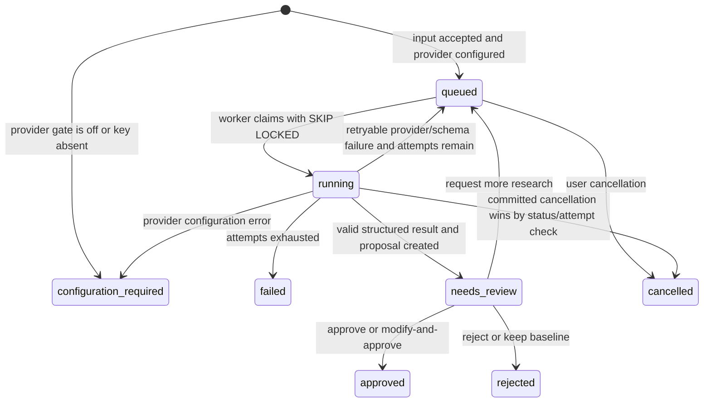

# Governed research workflow

The workbench research feature is a queue-and-review system for evidence gaps. It is not an autonomous baseline editor. Its output is a structured hypothesis and proposed revision that a reviewer can approve, modify, reject, send back for more research, or decline in favor of the existing baseline.

This document describes the implemented state machine in `web/src/server/services/research-workflow.ts`, the schema in `web/src/contracts/research.ts`, the deterministic confidence rule in `web/src/domain/confidence.ts`, the typed approval writer in `web/src/server/services/research-materialization.ts`, and the provider adapter in `web/src/server/ai/openai-research-adapter.ts`. Unit/schema tests exist, but this handoff does **not** claim a successful live OpenAI/web-search run or credentialed end-to-end research run.

## Safety contract

Every research run must preserve these constraints:

- The supplied baseline is immutable input. The worker may compare and propose; it may not update it.
- Every material numeric claim must point to a source index with institution, title, final URL, locator, reference/publication time where available, access time, used value, and source tier.
- Entity unit and denominator remain explicit. No person/household/establishment/enterprise conversion is allowed without an evidenced bridge.
- Low/Base/High must be ordered. When evidence is insufficient, the interval is null rather than fabricated.
- Direct observation, proxy, and inference are labeled separately.
- Limitations, confidence components, variables to verify, affected segments, and the recommended action are required output fields.
- Search-results pages are not evidence. A final original source URL is required.
- Synthetic or AI-authored narrative is a hypothesis, never a fact about a real person. Personal identities and contact/account/address data are prohibited. A high-confidence pattern gate checks research creation, the complete enriched canonical payload immediately before persistence, review notes/modifications, and provider input/output for recognized email, phone, resident-registration, labeled account/financial-account, and detailed street-address forms without echoing rejected values. It is a bounded obvious-identifier guard, not universal PII or real-name detection.

## Process flow



The database vocabulary also includes `draft`, although the current create service inserts directly as `queued` or `configuration_required`.

## 1. Create a job

The UI Server Action or `POST /api/research` supplies:

```json
{
  "segmentId": "optional-saved-segment-uuid",
  "researchQuestion": "Which source can close this evidence gap?",
  "targetSegment": "대한민국의 명시적 대상 모집단",
  "targetVariable": "variable_name",
  "baseline": {}
}
```

`researchQuestion`, `targetSegment`, and `targetVariable` are required. `baseline` is optional. If a segment is supplied, the service reads its current version and pinned query/result/estimate snapshot from the migration-`018` release-safe `v_saved_segment_latest`, including filter, value-free result summary when suppressed, data layer, approval state, and Low/Base/High. It also normalizes the persisted conditions into separate feature, behavior, subtype, and archetype collections with their operators, values, entity units, resolution, evidence, dependency group, reference year, and **effective** enabled state. Effective enablement is computed recursively: a locally enabled condition beneath any disabled ancestor is retained as disabled provenance and is not presented to the provider as an active constraint. An explicitly supplied baseline takes precedence only as the baseline for the requested target variable; the saved segment remains contextual provenance.

Before hashing or queueing, the selected baseline is normalized to the canonical `researchBaselineSchema` fields: `estimateId`, `status`, `value`, `lowBaseHigh`, `unit`, `denominator`, `definition`, `sourceTitle`, and `version`. A non-empty input's original shape is retained separately as `snapshotProvenance`; a missing or empty baseline becomes `status=unavailable` with null value/interval and an explicit definition. When both explicit baseline and saved segment are supplied, `snapshotProvenance` is composite: `targetVariableBaseline` retains the explicit input and `segmentContext` retains the saved segment/version/pin/filter/condition context. This prevents a calculated segment population from masquerading as an observed baseline for a different requested variable.

Queue eligibility is checked before the transaction. For ordinary factor research, an explicitly supplied baseline that normalizes to `status=estimated` is rejected with `research_variable_already_calculable_from_existing_data`; the Queue is an evidence-gap path, not a duplicate calculator. A saved segment may itself be estimated without making another requested variable calculable, so attached segment context alone is not rejected. An unavailable, unknown, or `not_estimable` explicit target-variable baseline remains eligible. Opportunity idea targets are also eligible because they request an explicitly labeled hypothesis brief rather than a numeric replacement factor.

The HTTP route reads JSON under the shared 128 KiB streaming request cap. Declared or observed excess returns `413`; malformed JSON returns `400`. Provider-input and provider-output ceilings described below are separate worker-side limits.

At creation, the SHA-256 content hash of this payload is both `input_hash` and the workspace-scoped `idempotency_key`. Repeated identical submissions return the existing job rather than creating duplicate external work. A later request for more research rehashes `input_hash` with reviewer feedback while retaining the original creation idempotency key.

The provider configuration gate is deliberately explicit:

```text
OPENAI_RESEARCH_ENABLED=true
OPENAI_API_KEY=<non-empty server-side key>
```

Both values must be available to the Next server when it creates the job, because that process chooses `queued` versus `configuration_required`. They must also be available to the worker that executes the job. The key is server-only and must never be exposed through a `NEXT_PUBLIC_` variable or browser response.

When the gate is closed, the service creates a durable `configuration_required` job, a `configuration_required` event, and a skipped provider step. It makes no OpenAI request. Because idempotency returns the existing row, enabling the provider later does not automatically change that job to queued. The intentional recovery path is an explicit one-shot run of that reviewed UUID after enabling the gate; the continuous poller does not claim `configuration_required` rows. Do not update a production job ad hoc or send an unknown queued payload externally.

## 2. Claim and execute

Run one worker per process with:

```bash
cd web
npm run worker
```

For controlled diagnosis or deliberate recovery of one configuration-required job, target its reviewed UUID:

```bash
cd web
RESEARCH_JOB_ID=123e4567-e89b-42d3-a456-426614174000 npm run worker:once
```

The one-shot command rejects a missing/non-UUID ID and returns `research_job_not_ready_or_not_queued` unless that exact workspace-visible job is `queued` or `configuration_required` and eligible to run. This guard prevents an operator from accidentally sending an unknown oldest queued payload to the provider.

The worker polls every `RESEARCH_POLL_INTERVAL_MS` (default 1500 ms, clamped to 250–60,000 ms). It selects the highest-priority/oldest eligible `queued` job with `FOR UPDATE SKIP LOCKED`, so multiple worker processes do not claim the same row. The claim transaction:

1. changes the job to `running`;
2. increments `attempt_count`;
3. marks step 1 (`provider_research`) running; and
4. appends a sequenced `running` event.

Before selecting a new job, the same claim transaction runs `recoverExpiredRunningJobs` with `RESEARCH_RUNNING_LEASE_MS` (default 300 seconds, clamped to 60–3,600 seconds). An expired attempt is requeued when attempt budget remains or marked failed when exhausted, and the recovery is recorded in the job/step/event ledger. This is poll-driven recovery, not a heartbeat: if no worker polls, a stale `running` row remains until the next claim cycle.

The current OpenAI adapter uses the Responses API, structured Zod output, web search, `store: false`, a 120-second request timeout, one SDK-level retry, and the configured `OPENAI_RESEARCH_MODEL` (default `gpt-5.6`). It asks the API to return `web_search_call.action.sources` and builds its provider-source ledger only from calls whose status is `completed`, collecting URLs returned by `search` plus visited URLs from `open_page`/`find` actions. Incomplete calls contribute no URLs. It caps provider output at 12,000 tokens, serialized provider input at 128 KiB, and the structured provider result at 256 KiB. The Zod contract also bounds string lengths and repeated arrays (including factors, sources, citations, limitations, affected segments, and source-index lists) before persistence. These are server safety ceilings, not permission to fill every field to its maximum. A model name being configured does not prove it is available to a particular account; verify access and response behavior in the deployment environment before enabling the queue.

## 3. Validate the research result

The exact `research-result-v2` object is strict: unknown top-level fields fail validation. It contains:

| Field | Required meaning |
|---|---|
| `researchQuestion`, `targetSegment`, `targetVariable` | Echoed scope of the task |
| `existingBaseline` | The baseline as understood by the research result; retained for hash/delta review |
| `proposedFactors[]` | Named interval, denominator, observation class, and source indexes |
| `lowBaseHigh` | Ordered interval or null when evidence is insufficient |
| `denominator`, `geography`, `referenceYear` | Population/time scope |
| `sources[]` | Institution, title, URL, publication/reference dates, access time, locator, used value, tier |
| `citations[]` | Claim plus zero-based source index |
| `inferenceMethod`, `limitations[]` | How the conclusion was derived and bounded |
| `confidenceComponents` | All 12 named 0–100 inputs required by the deterministic server rule; the provider does not supply the final score or grade |
| `variablesToVerify[]`, `affectedSegments[]` | Remaining validation and invalidation scope |
| `recommendedAction` | `approve`, `modify`, `research_more`, or `keep_baseline` |
| `opportunityIdeaBrief` | Nullable AI hypothesis brief. It is required only when `targetVariable` is `opportunity_idea_brief:<opportunity-uuid>` and must be null for ordinary factor research. It contains mandatory `sourceFeatureIds` and `sourceBehaviorIds` arrays (empty when no matching condition applies). |

The validator rejects a citation, factor, or Opportunity idea evidence index that points beyond the `sources` array. Opportunity idea evidence must contain at least one unique source index, and every such source must also have a matching citation. At approval, every Opportunity idea `sourceFeatureId` and `sourceBehaviorId` must exactly match an effectively enabled, queryable, type-correct condition in the pinned query result; invented, disabled, wrong-kind, wrong-workspace, or stale IDs fail closed. Stored provenance preserves the verified operator, value, entity unit, reference year, evidence, dependency group, and catalog record rather than trusting provider-authored labels. After schema validation, the adapter normalizes every structured source URL and requires an exact match to a URL returned by the web-search tool's `search`/`open_page`/`find` activity; obvious search-results pages are rejected. It does not independently fetch each URL or prove that the source supports the claim. Locator/claim verification remains a reviewer responsibility.

The provider's `existingBaseline` and task identity fields are echoes, not authority. Completion compares them with the canonical job input and stores mismatches as artifact validation warnings. The proposal continues to use the canonical job question, segment, variable, and baseline; a structurally valid provider result is not allowed to replace those values.

## 4. Persist a proposal, not a baseline edit

On valid output the worker atomically:

- appends a `structured_result` artifact with response ID URI, SHA-256, provider/model/usage, schema `research-result-v2`, canonical-echo validation metadata/warnings, and `validation_status=valid`;
- computes separate hashes for the existing baseline and proposed payload;
- creates or reuses a `proposed_revision` with `pending_review` status;
- creates one pending `review_item` at priority 2;
- marks the job `needs_review` and its step `succeeded`; and
- appends a `needs_review` event containing the proposal ID and result hash.

The proposal captures factors, interval, denominator, geography, reference year, sources/citations, inference method, limitations, confidence components, variables to verify, affected segments, expected recalculation, and recommended action. Its structured review delta records denominator comparability, baseline/proposed value and interval changes, confidence score/grade change, per-source freshness, and computation time. The expected-recalculation envelope records affected segment IDs, whether invalidation/recalculation would be required after governed materialization, and the expected action. No canonical estimate/source/evidence row is modified by this completion transaction, and this envelope is not evidence that recalculation already happened.

At the proposal stage, the structured source bundle lives inside the artifact/proposed payload. The service does not automatically create vetted `data_source`, `source_release`, `evidence`, or `proposed_revision_evidence` rows. On approval, an estimable numeric proposal with at least one valid source and citation is copied into the narrower append-only `approved_research_factor` / `approved_research_factor_source` ledger described below. Before publishing a replacement estimate, an operator must still register/verify canonical source-release/evidence records and satisfy the repository's source-release, period, denominator, method, confidence, and gap requirements.

## 5. Retry and failure behavior

The default maximum is three worker attempts. A non-configuration failure is classified as:

- `schema_validation_failed` for a structured-output validation error; or
- `provider_request_failed` for other provider/request failures.

An append-only error artifact records the code/message and validation failure. If attempts remain, the job returns to `queued`, the step becomes `retrying`, and `next_attempt_at` applies exponential backoff of approximately 2, 4, … seconds capped at 60 seconds. When attempts are exhausted, the job/step become `failed`.

A `ResearchConfigurationError` is non-retryable: the job becomes `configuration_required`, the step becomes `skipped`, and no next attempt is scheduled. Provider failures do not cause null evidence to be treated as zero or a proposal to be approved.

## 6. Human review

The UI accepts these decisions:

| UI decision | Database decision | State/result |
|---|---|---|
| `approve` | `approve` | Creates an approved `data_release_version`; an estimable, cited numeric payload also creates a typed approved factor/source bundle; proposal, review, and job become approved. An Opportunity idea target also appends the governed AI hypothesis content version described below. |
| `approve_modified` | `modify_and_approve` | Requires `modification_json`; hashes and validates the modified payload, then applies the same release/factor/Opportunity materialization rules. |
| `reject` | `reject` | Proposal/review/job become rejected. |
| `request_more_research` | same | Review becomes `changes_requested`; job and step return to queued; at least three additional attempts are allowed. |
| `keep_baseline` | `keep_existing` | Proposal becomes rejected, review closes, and job becomes rejected; the baseline remains unchanged. |

Every decision is append-only with rationale, actor, sequence, and time. The Server Action requires a non-blank user-authored review note; it no longer substitutes a fallback rationale. The review UI presents an accessible confirmation step before submitting a terminal decision. The service also appends an audit event and a job event where applicable. `request_more_research` appends the review note to `reviewFeedback`, rehashes the canonical job input and step input, and supplies that feedback as a constraint on the next provider prompt. The review UI renders baseline versus proposed values/intervals, denominator status, confidence change, source freshness, affected segments, and expected invalidation/recalculation before the decision controls. Unavailable or incomparable fields remain explicitly labeled rather than coerced into a numeric delta.

Approval is a governance decision, not automatic baseline publication. The service creates a workspace-scoped `approved` release against the exact configured `MARKET_ENGINE_MODEL_VERSION`, or `kr-v0.2.1` when unset, and marks the proposal approved. It never sets `published_at`, rewrites the baseline table, or automatically creates a replacement estimate. The calculation service does not query `approved_research_factor`; without a separate reviewer-owned, unit-safe publication binding to canonical source/release/evidence and a versioned estimate dependency, the target count remains `not_estimable` and no cache is invalidated.

If the approved payload has a non-null `lowBaseHigh`, approval must also validate an ordered interval, denominator, geography, inference method, a 1900–2200 nullable reference year, 1–32 sources, 1–96 citations, valid citation indexes, all 12 confidence components, and bounded explicit penalties. The server calculates the final score and grade using `research-confidence-v1` (or the reviewed rule label); it does not accept an LLM-authored final confidence score. The transaction writes:

- one append-only, workspace-scoped `approved_research_factor` linked to the proposal and approved release;
- one append-only `approved_research_factor_source` row per reviewed source, including institution, title, original URL, publication/reference dates, access time, locator, used value, tier, cited claims, and content hash; and
- `proposed_revision.materialized_factor_id` linking the decision to that typed factor.

Migration `012_approved_research_factor_snapshot_hardening.sql` treats those parent and child rows as one atomic immutable snapshot. The factor declares `source_count` (1–32) and its creation transaction; only the approving workspace owner/reviewer may insert the exactly indexed source rows in that transaction. A deferred commit-time trigger rejects a missing, extra, or non-contiguous source set, and later transactions cannot append another source even when run by the same reviewer. Proposal, factor, and workspace-scoped release provenance must stay in the same workspace; a governed global release may still anchor a workspace factor. An idempotent service replay may reuse an existing factor only after its bundle hash, source count, and every ordered source hash match; it does not reopen the sealed snapshot.

The optional entity unit is inherited only from the canonical baseline envelope when it is one of the supported units. A prevalence/probability remains a factor interval; it is never copied into `estimate.count_low/base/high`. A null `lowBaseHigh` can still record an approved review outcome but creates no numeric factor.

There is one deliberately narrower content-materialization path. If `targetVariable` is `opportunity_idea_brief:<opportunity-uuid>`, approval requires a schema-valid `opportunityIdeaBrief` and appends an `opportunity_content_version` with `content_key=idea_brief`, `content_type=idea_brief`, and `source_kind=ai_hypothesis`. The version carries the research/proposal/release IDs, canonical baseline hash, provider model, sources/citations/limitations/confidence, the Opportunity's pinned query-result and market-estimate references when available, subtype/archetype IDs recovered from snapshot provenance, and separately verified feature/behavior condition provenance. It does not overwrite `opportunity.solution_idea`, and its `ai_hypothesis` classification must remain visible wherever it is rendered.

A downstream governed publication step must still validate the proposal's evidence lineage, create canonical source/release/evidence records and any new versioned estimate, set supersession/publication links, recalculate genuinely dependent segments, and run the full engine validation. Until that step exists and is executed, do not describe an approved proposal, approved factor, or idea brief as a deployed baseline change.

Approval invalidates query results only when the proposal is already tied to a materialized estimate dependency, targets a calculation-relevant record kind, and identifies affected saved segments. A standalone reviewed factor is durable production workbench data, but it does not invalidate an unrelated calculation merely because `affectedSegments` was proposed; the research event records `approved_revision_has_no_materialized_calculation_dependency` as the skip reason.

## 7. Cancellation and terminal states

Cancellation is accepted only from `draft`, `queued`, `running`, or `configuration_required`. It sets `cancelled`, records `finished_at`, appends a cancellation event, and writes an audit record; all other states reject cancellation. Provider completion and failure transactions re-lock the job and require the same `running` attempt, so an in-flight result cannot overwrite a successfully committed cancellation.

## Evidence-review checklist

Before approving or materializing any research proposal, confirm all of the following:

- The final URLs open the original releases, not search-result or aggregator pages.
- Institution/title, publication date, reference period, access time, locator, and used value agree with the source.
- Population universe and entity unit match the target; any conversion uses an approved bridge.
- Denominator and formula reproduce the factor/interval.
- Direct/proxy/inferred labels are honest, and Low/Base/High contain the uncertainty introduced by proxy/inference.
- Contradictory evidence and limitations are retained, not edited out.
- Confidence scoring and validation gaps are reviewed under the current rule version.
- Affected saved segments/estimates are identified for cache invalidation and recalculation.
- No real-person identity, contact, address, account identifier, or minor identity is present.
- Canonical evidence/source-release records are created and linked before an estimate is published.

## Operational observability

Use the job detail route for a full record and the event route for incremental polling:

```bash
curl --fail-with-body "http://localhost:3000/api/research/${JOB_ID}"
curl --fail-with-body "http://localhost:3000/api/research/jobs/${JOB_ID}/events?after=0"
```

Useful fields are `status`, `attempt_count`, `max_attempts`, `next_attempt_at`, `error_code`, `error_message`, ordered events, artifact validation status/errors, proposal hashes/status, and review status. Do not log API keys, access secrets, full provider requests containing sensitive input, or raw authentication cookies.

## Current validation boundary

Migration source and the disposable initial/full-reapply harness extend through `018` at 90 tables/17 views, and a populated clone has `017`–`018` applied with its raw fingerprint preserved. The original populated local database remains deliberately at `016`/90 tables/12 views. The final local aggregate passed: database-enabled Python 67 tests with one Starlette deprecation warning (65 passed/2 skipped without the database environment), engine validation 46/46, TypeScript, zero-warning lint, 44 files/261 unit tests, 6 files/44 actual-PostgreSQL integration tests, production build, and browser 22 passed/5 intended skips. The SQL harness passed initial application and full reapplication. The `018` populated-clone performance run generated at `2026-08-25T13:50:49.812Z` with status `remediated_with_remaining_risks`: 10 queries, 8 below 3 ms, maximum 24.128 ms, no result above 50 ms, no physical reads, and no temporary spills.

No external provider call occurred, research opt-in remained off, the server-only credential was not used, and the exact approval phrase `위 payload 그대로 외부 호출 승인.` has not been received. A live job reaching `needs_review`, its human review, governed publication decision, and baseline-isolation check remain pending. An approved factor/release remains unpublished and has no calculation consumer, so it does not create a replacement estimate or invalidate calculations. Separately, the overall Phase 3 baseline is 17/18 FAILED solely because the live Phase 2 DoD verifier cannot establish the historical Nemotron direct-acquisition execution provenance (29 passed/0 failed/1 unavailable); an independent holdout also remains unavailable. Run a live test only after separate exact authorization in a cost-aware environment with non-sensitive research input, retain a sanitized evidence/validation record, and keep any secret or raw provider trace out of the repository.
